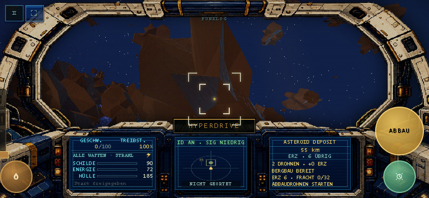
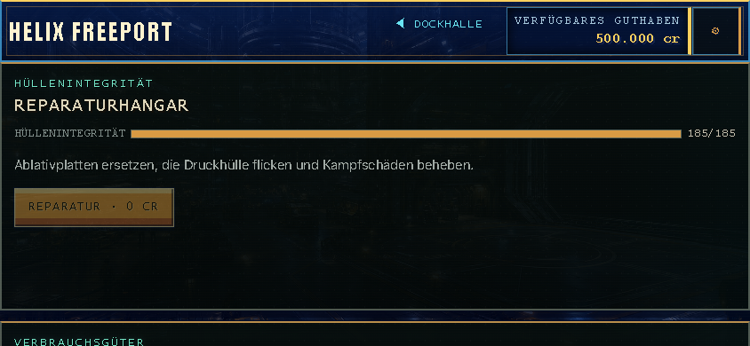
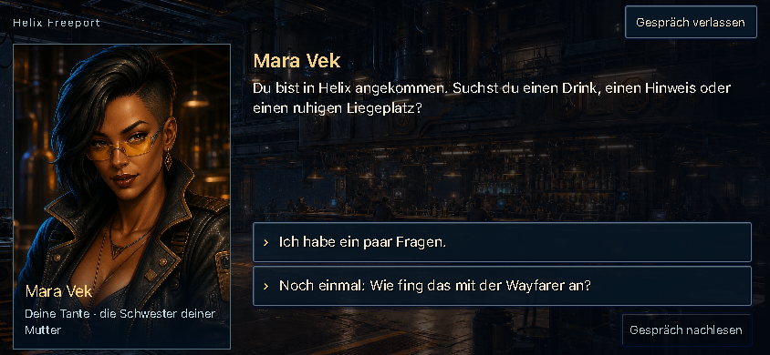

# Voidrunner interface review — 12 September 2026

The largest gains will come from readable cockpit information, consistent menu navigation, and a clearer first few minutes. Preserve the cockpit and station artwork. Simplify the information inside them before adding more decoration.

This is a review and proposed direction, not an implemented redesign.

## Coverage and limits

Reviewed the local 0.8.2a drone build. Captured the 17 main interface surfaces: flight, pause, ship computer, navigation, concourse, services, market entrance, commodity exchange, outfitting, ship systems, shipyard, bar, missions, guilds, options, arena setup, and title. Also inspected galaxy navigation, mission details, equipment selection, dialogue, and new-career confirmation. Read the implementations of conditional monitor states, the bounty registry, arena reward/fitting screens, and settings.

Viewport checks: 667×375 and 844×390 touch phones; 390×844 portrait; 1024×768 touch tablet; 1366×768 laptop and 1920×1080 desktop with mouse/keyboard profiles. A 1440×900 touch layout was also captured. Browser checks used Chromium with simulated touch. Physical iPhone/Safari, real notches/browser bars, tilt permission prompts, screen readers, and every quest/combat/race branch were not tested. These findings are not a WCAG conformance audit.

Screens were placed into reproducible states through existing debug/UI hooks; representative detail buttons were clicked normally. Initial capture-fixture mistakes left title/dialogue overlays over a few later scenes. Those captures were excluded from findings; clean flight and relevant detail captures were taken separately. No runtime page errors were reported.

## Priorities

| Priority | Finding and evidence | Recommended change |
|---|---|---|
| High | Phone cockpit text is too dense for its available area. Speed, weapons, three health/resource bars, status text and mining details compete in three small apertures. Compare [phone-flight.png](captures/phone-flight.png) with `desktop-flight.png`. | Give phones a deliberately reduced monitor layout and larger text. Keep all telemetry in the cockpit. Do not scale down the desktop content wholesale. |
| High | Portrait mode blocks everything, including Options and station menus. [portrait-options.png](captures/portrait-options.png); `ui.js:updateOrientationNotice`. | Require landscape for flight only. Allow title, settings, missions, trade and ship management to reflow in portrait. |
| High | Several phone pages spend most of the visible height on headers or one oversized section. Services initially shows only hull repair; fuel and drones are further down. Ship systems shows bay mode before its servicing control. | One compact header, a single scroll area, and a persistent primary-action footer. Make service rows fit their content rather than maintaining empty card height. |
| High | Scrolling Trade can leave Buy visible without the commodity name; scrolling Options moves Close offscreen. See [phone-trade-detail.png](captures/phone-trade-detail.png) and [phone-settings-bottom.png](captures/phone-settings-bottom.png). | Keep the selected item/title and Back/Close in a compact fixed header, with only the body scrolling. |
| High | Essential cockpit actions are small or look like readouts. At 844×390, measured weapon-selector bounds were about 156×15 px, transponder 140×18, pause/fullscreen 36×32, and hyperdrive 160×28. | Increase actual hit areas without overlap. Make interactive monitor elements visually distinguishable and teach each once. Use 44–48 px touch areas as the design target. These bounds alone do not establish a WCAG failure. |
| Medium | New players must infer game vocabulary and navigation: Bar contains missions, the map contains both travel and contacts, and bay type does not itself buy a drone. | Keep the fiction, but add functional labels and a short guided route through first launch, first contract and first mining delivery. |
| Medium | Presentation changes sharply between screens: bright blue title buttons, textured service cards, flat fitting panels, pixel-sized labels, and much more readable dialogue text. Some German screens retain English labels such as WEAPONS. | Reuse the navy/gold/cyan palette, a small set of text styles and one button hierarchy. Use the dialogue typography as the model for explanatory text. Complete localization. |
| Medium | Large screens gain space without always gaining useful structure. Equipment choices become very wide rows, while some modal text stays relatively small. | Use bounded reading columns and side-by-side selection/comparison on desktop; do not stretch every row or proportionally shrink the entire UI. |
| Medium | Modal accessibility is inconsistent. New-career confirmation has focus handling; the generic pause/map/ship/arena containers lack equivalent dialog semantics and focus management in their open methods. | Reuse a shared modal lifecycle: initial focus, contained Tab navigation, Escape where appropriate, inert background and restored focus. Preserve the stronger existing confirmation/dialogue patterns. |

## Cockpit monitors

| Surface | Keep | Change |
|---|---|---|
| Own ship, left | Speed/fuel, shield/energy/hull bars, physical monitor location. | On phones, prioritize speed and the three survival bars. Use a compact fuel readout and one clear weapon/group control. Move detailed load, handling and equipment explanations to the paused ship computer. Shrink or omit the decorative hull silhouette before shrinking labels. |
| Radar, centre | Radar as the visual centre; tap to open navigation. | Make the map action discoverable with a brief first-use hint. Explain ID/transponder and signature in the ship computer; give its toggle a distinct hit area. Use shape plus text to explain selected, friendly and hostile contacts. |
| Target, right | Contextual ship/location/deposit information. | Use four layers: target name; distance; current state/progress; next action or blocking reason. For mining: “Ore deposit”, “55 km”, “2 miners · 1 ore returning”, “Recall drones”. Avoid repeating resource counts or instructions. For blocked actions, say why: “Move within 100 km”, “Hold full”, or “No mining bay”. |
| Radio/event monitor | Integrated cockpit placement and log history. | Increase the priority difference between danger, useful feedback and ambient chatter. Show one short message at a time. Make missed messages easy to find in the ship computer; do not solve readability with permanent floating HUD cards. |
| Hyperdrive and touch controls | Contextual primary/secondary pads; queued drone recovery. | Keep stable pad positions, pair icons with short verb labels, and show progress/state in the target monitor. Distinguish tap actions from held actions in the first-use help. Explain “Recovering drones” as a normal departure step. |

A phone monitor must be redesigned around its aperture. A minimum text size will not help if seven rows are still forced into the same space. Increase usable monitor area and reduce simultaneous content together. A tap for more detail should open the paused ship-computer view, not a floating telemetry card over flight.

## Menu-by-menu recommendations

| Menu | Assessment | Best next change |
|---|---|---|
| Title / career | Clear main buttons, but different visual treatment from the rest of the game; new players face setup and game-mode choices together. | A prominent Continue or Start career, with a short “Guided first flight” explanation. Keep simulator and settings secondary. Request tilt permission in a clear setup step and show whether calibration succeeded. |
| New-career confirmation | Readable wording, clear consequences, and stronger focus handling than most overlays. | Reuse this interaction pattern elsewhere; retain explicit destructive wording. |
| Concourse / landing | Station artwork and spatial hotspots give a strong sense of place. Their purpose is less obvious to newcomers. | Add functional subtitles: “Bar · contracts and contacts”, “Market · trade and equipment”, “Service · fuel, repairs and drones”. Give Launch an unmistakable label on the ship hotspot. |
| Market entrance | Attractive but introduces another navigation layer before any transaction. | Keep the scene, while offering direct Trade / Equipment / Ships navigation in a consistent header. |
| Commodity exchange | Useful economic information, but the empty cargo panel and catalog header delay the buying task on phones. Long commodity names wrap awkwardly in the grid. | Compact empty cargo state. Use a vertical commodity list or fewer columns on phones. Keep selected item, unit price, quantity, total cost and free hold space together. Place route intelligence under Details. |
| Services | A single repair card can consume almost the whole phone screen even when the hull is full. | Compact Hull / Fuel and ammunition / Drones rows with status and price. Show “Ready” instead of a prominent disabled zero-cost action. Keep recovery/insurance explanations separate from routine servicing. |
| Outfitting overview | Physical mount selection is a good model. Repeated long rows and stacked navigation consume space. | Short mount rows: mount, installed item, Change. One header reading “Equipment”, with Back and credits. Fix the back-arrow/label overlap visible on narrow captures. |
| Equipment choice / comparison | Item descriptions explain function, but selection and comparison are still wordy and strongly capitalized. | Begin with practical effects: “Strips shields”, “Good against hull”, “Automatic missile defense”. Show differences from the fitted item next. Put fire interval and detailed statistics under Details. Keep Buy & install visible. |
| Ship systems / drones | Setup is now colocated, but mode buttons appear above the service action on short screens. | Show each bay as a compact status row: “2 miners · ready” or “PDC · empty · fill 1,500 cr”. Keep setup instructions beside the relevant action and show PDC instructions only for a PDC setup; the current mining-bay view also displays the long PDC explanation. Clearly separate fitted hardware from the DEFEND/STOW operating state. |
| Shipyard | Good model preview and comparison deltas. On phones, extensive chrome and statistics push the financial decision down. | Lead with role and tradeoffs: “Fast fighter · 16 cargo · no mining drones”. Follow with current-ship comparison, trade-in and amount due. Keep the purchase button visible; detailed stats can expand. |
| Bar / contacts | The spatial scene works, but contacts, missions and guilds compete for attention. | Keep clear Contracts and Guilds shortcuts; mark a contact with a concrete purpose or an actual new quest, rather than undifferentiated “new contact” labels. |
| Dialogue / adventure | Among the most readable surfaces: sentence-case body text, distinct choices, clear speaker. | Reuse its text treatment. Keep the exit and history controls reachable while allowing long conversations to scroll; bound line length on desktop. |
| Mission board | Phone list/detail separation is useful. The captured board begins with several races, without a clear beginner route. | Offer a recommended starter contract and filters by activity. Rows should emphasize task, destination, reward and risk. Show requirements before acceptance. |
| Mission dossier / race entry | Accept & set course is a good combined action, but dense descriptions precede the decision. | Put reward, requirements, deadline and risk in a short summary, then the objective. Keep the acceptance action visible. Explain race entry fee and payout tiers with a compact list. |
| Guilds / bounty registry | Benefits, rank and cost are present; registry is nested with membership information. | Explain “What joining gives you now” first. Keep next-rank details expandable. Put cleared bounties in a separate history section so growth does not bury membership controls. |
| Sector / galaxy navigation | Clear separation of scales; local contacts still compete with destinations on phones. | Phone tabs for Destinations and Nearby contacts. Selected destination should show distance, required gate/route and a clear Set course action. Explain that selecting a destination and engaging hyperdrive are separate steps. |
| Ship computer / cargo / log | Groups are useful, but the event log appears before the tasks players are likely opening the computer to perform. | Start with current objective and ship/drone readiness, then cargo and equipment. Collapse log/history. Since one cargo unit now uses one space, prefer “12/32 cargo” to repeated units and decimal mass. |
| Pause / options | Long settings grid; phone users must scroll past several sections. The reference is headed Keyboard / Controller even in a touch profile. | Separate Controls, Audio, Display and Accessibility. Show the current input method first. Update the controls text for drone tap actions and remove/reconcile the joystick choice with the intended tilt-only phone design. Keep Resume/Close visible. |
| Arena setup / wave rewards | Setup mixes a quick fight with the separate Arena Run and many configuration options. Between-wave fitting is another presentation of equipment. | Lead with a safe “Practice: rookie, 1v1” preset and a clear separate Arena Run entry. Put custom conditions behind Customize. Reuse equipment wording and comparison patterns for reward/fitting choices. Conditional wave screens were reviewed in source, not every run state. |

## Responsive and accessibility direction

| Size / input | Proposed layout rule |
|---|---|
| Short landscape phones, 375–430 px high | One compact navigation header and one action footer. One main scroll region. Prefer list → detail navigation to several side-by-side panes. Preserve cockpit monitor positions with fewer, larger readouts. |
| Portrait phones | Menus use a normal vertical flow. Only entering flight prompts rotation. Preserve selections and scroll when rotating. |
| Tablets | Use two columns only where both remain readable. Keep touch target sizes even though there is more screen area. Avoid enlarging artwork while leaving controls tiny. |
| Laptops | Watch vertical space: ship comparisons, mission dossiers and settings still need reachable actions at 768 px high. |
| Large desktops | Bounded reading widths; list and comparison panes. More whitespace should clarify groups, not separate labels from their values. Add independent UI/text scaling rather than scaling the whole cockpit image. |

Proposed design targets: ordinary menu body text around 16 px, secondary text around 14 px, and 44–48 px touch controls. Reserve small pixel lettering and all-caps for short instrument labels and headings. Use gold for the primary action/current choice, cyan for information, and explicit text or icons alongside warning colors. Use a quieter solid backing behind text; offer reduced scanlines, UI motion and screen effects.

These are design targets, not a claim that WCAG requires a universal 16 px font. WCAG 2.2's minimum pointer-target criterion is 24×24 CSS px with exceptions; larger targets remain useful for touch. Check actual hit regions and spacing, not only the visible icon. [W3C target-size guidance](https://www.w3.org/WAI/WCAG22/Understanding/target-size-minimum.html).

Measure text contrast against the rendered background, including textures and transparency. Aim for at least 4.5:1 for ordinary text. No comprehensive contrast measurement was performed in this review. [W3C contrast guidance](https://www.w3.org/WAI/WCAG22/Understanding/contrast-minimum.html).

Standardize modal focus, keyboard navigation, background inertness and focus restoration using the existing stronger dialogs as the starting point. [W3C modal-dialog pattern](https://www.w3.org/WAI/ARIA/apg/patterns/dialog-modal/). The current reduced-motion CSS covers the hovering dock ship specifically; it is not yet a general UI-effects preference.

## Suggested implementation order

1. **Readability and access:** phone monitor content, larger hit regions, portrait menus, plain-language controls help, complete localization, shared modal behavior.
2. **One menu structure:** compact headers, consistent Back placement, one scroll area, visible primary action. Apply first to Services, Ship systems, Trade and mission details.
3. **Learning and comparisons:** guided first flight, recommended starter contract, clear mining/PDC setup, concise equipment and ship tradeoffs, device-specific help.
4. **Visual polish:** typography, contrast, border hierarchy, quieter text surfaces, desktop reading widths, reduced effects.

Acceptance should be based on tasks: a new player can launch, select a destination, start a contract, understand a disabled action, refuel, fit a PDC, mine and deliver ore without searching outside the game. Recheck those flows at the listed sizes, with German and English, larger text, keyboard-only menu navigation, and on a real iPhone and Android device. Do not run unrelated simulation regressions for a visual-only pass.

## Representative captures

Phone cockpit:

Phone services: fuel and drone servicing are below the first screenful.

Readable dialogue as a reference for body text:

